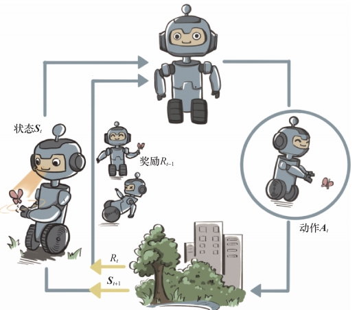

# 第 1 章 初探强化学习

强化学习（reinforcement learning，RL）研究的是**序贯决策**：智能体不断观察环境、采取动作、接收奖励，并希望通过长期的试错学习，找到能最大化累积奖励期望的策略。

## 1.1 强化学习的基本交互过程

### (1) 智能体、环境与一轮交互

强化学习中的机器称为**智能体（agent）**。在第 $t$ 轮交互中，可以用下面的抽象过程表示：

1. 智能体感知环境状态 $s_t$；
2. 智能体依据当前策略选择动作 $a_t$；
3. 环境执行动作，产生即时奖励 $r_{t+1}$；
4. 环境转移到下一状态 $s_{t+1}$；
5. 智能体在新状态下继续决策，循环往复。

这一过程与一次性的分类或回归不同：动作会改变环境，环境的变化又会影响后续可观测状态和可获得奖励，所以问题具有明显的时间关联。

### (2) 智能体的三个关键要素

- **感知（perception）**：从环境中获得与决策有关的状态信息
- **决策（decision）**：根据当前状态计算应该采取的动作。
- 智能体最终体现出的决策规则称为**策略（policy）**，它是不同智能体之间的核心区别。
- **奖励（reward）**：环境返回的标量反馈，用来评价当前状态或动作的即时效果。

奖励是局部、即时的反馈，而智能体要优化的是多轮交互后的整体表现。因此，眼前奖励最高的动作未必是长期最优动作，这正是序贯决策区别于单步预测的关键。

## 1.2 强化学习的环境：动态随机过程

环境不是静态的数据集，而是会随时间演变的**动态系统**。通过随机过程描述环境，最重要的要素是状态以及状态如何转移的条件概率分布。

当智能体动作加入环境后，下一时刻状态由当前状态和动作共同决定，可写为：

$$
s_{t+1} \sim P(\cdot\mid s_t,a_t)
$$

其中 $P$ 是环境的状态转移分布。这个表达式强调两层随机性：

- 智能体策略可能以概率方式选择动作；
- 环境也可能根据当前状态和动作随机采样下一状态。

所以，即使初始状态和策略都相同，不同次交互也可能产生不同轨迹和不同回报。强化学习需要在这种不断演变且带随机性的过程中学习，而不是在固定分布的数据上被动拟合。

## 1.3 强化学习的目标：最大化价值

每轮奖励可以沿交互轨迹累加，得到一次交互的**回报（return）**。由于环境和策略可能有随机性，同一策略的不同轨迹回报不一定相同，因此强化学习关心的是回报的期望，并将其称为策略的**价值（value）**。用概念化的形式表示：

$$
\text{目标：}\quad \max_{\pi}\;\mathbb{E}[G\mid \pi,\text{环境}],
$$

其中 $\pi$ 表示策略，$G$ 表示多轮奖励形成的回报。这里的期望需要同时考虑策略的动作分布和环境的状态转移分布。因而，智能体学习的核心不是让某一步动作看起来最好，而是在长期交互中提升整体价值。

## 1.4 强化学习中的数据与占用度量

### (1) 数据分布会被策略改变

监督学习通常先给定一个固定训练集，再在该数据分布上优化损失。

强化学习的数据则是在“智能体—环境”交互时在线产生的：如果策略从未选择某个动作，与该动作相关的状态—动作数据就不会被观测到。

因此，策略一旦变化，后续访问到的状态、动作和奖励样本也会变化。

智能体不是在固定数据集上反复训练，而是在学习过程中持续改变自己的数据来源。

### (2) 占用度量

**占用度量（occupancy measure）** ：在给定策略与动态环境交互时，采样到各个状态—动作对 $(s,a)$ 的概率分布（归一化后）。它把“策略与环境共同产生了什么数据”用一个分布表示出来。

1. 在给定环境下，两个策略产生相同占用度量，当且仅当两个策略相同。策略改变会导致交互数据分布改变。
2. 奖励定义在状态—动作对上，策略价值可以看成奖励函数在其占用度量下的期望。因此，寻找最优策略也可以理解为寻找能产生最优占用度量的策略。

## 1.5 强化学习与监督学习的根本区别

两者都可以抽象为在某个分布下优化一个分数的期望，但“优化分数的方式”不同：

| 对比维度 | 监督学习 | 强化学习 |
| --- | --- | --- |
| 任务形态 | 通常是单轮的预测任务 | 多轮的序贯决策任务 |
| 数据来源 | 从预先给定且基本固定的数据分布采样 | 由智能体与环境交互产生 |
| 学习对象 | 模型函数，从特征预测标签 | 策略，根据状态选择动作 |
| 优化对象 | 给定分布下的损失期望，通常希望最小化 | 策略占用度量下的奖励期望，希望最大化 |
| 参数改变后的影响 | 主要改变模型输出，数据分布不随之改变 | 改变策略，进而改变未来交互数据分布 |
| 时间与后果 | 样本通常相互独立，预测不改变未来样本 | 动作影响后续状态、奖励和可见数据 |

可以将两种范式概括为：

$$
\text{监督学习：}\quad \min_f\;\mathbb{E}_{(x,y)\sim D}[L(y,f(x))]
$$

$$
\text{强化学习：}\quad \max_\pi\;\mathbb{E}_{(s,a)\sim d^\pi}[r(s,a)]
$$

其中 $D$ 是给定的数据分布，$d^\pi$ 是策略 $\pi$ 与环境交互得到的占用度量。监督学习主要是在固定数据分布上改变模型；强化学习则主要通过改变策略来改变数据分布，同时优化奖励期望。

## 结论

1. 强化学习是机器通过与环境交互、根据奖励试错学习的计算方法。
2. 智能体的闭环是“状态 → 动作 → 奖励和下一状态”，而不是一次性的输入 → 输出。
3. 环境通常是动态随机过程，状态转移由当前状态和动作共同决定。
4. 即时奖励不等于长期目标，真正的优化目标是回报的期望（价值）。
5. 策略的改变会改变占用度量，进而改变智能体接下来能看到的数据。
6. 强化学习的主要难点之一，是在不断变化的数据分布上学习长期决策。

## 易混点

- **奖励 vs. 回报**：奖励是单轮反馈；回报是多轮奖励的累积结果。
- **回报 vs. 价值**：一次轨迹得到一个回报；在随机环境下，对回报取期望才得到价值。
- **状态 vs. 动作**：状态是环境当前提供给智能体的信息；动作是智能体施加给环境的决策。
- **策略改变模型输出 vs. 改变数据分布**：在监督学习中，模型更新通常不改变训练集；在强化学习中，策略更新会改变后续访问到的状态—动作分布。
- **即时最优 vs. 长期最优**：当前奖励最大的动作可能导致较差的后续状态，不能只依据单步反馈做判断。
